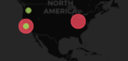
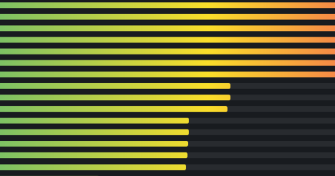

## DataCap and CID Checker Report
 - Organization: `Some Company Inc`
 - Project: `My Project`
 - Client: `f12345`
### Storage Provider Distribution
The below table shows the distribution of storage providers that have stored data for this client.
For most of the datacap application, below restrictions should apply. GeoIP locations are resolved with Maxmind GeoIP database.
 - Storage provider should not exceed 25% of total deal size.
 - Storage provider should not be storing same data more than 25%.
 - Storage provider should have published its public IP address.
 - The storage providers should be located in different regions.

⚠️ [provider0](https://filfox.info/en/address/provider0) has sealed more than 25% of total deals.

⚠️ [provider0](https://filfox.info/en/address/provider0) has sealed same data more than 25%.

⚠️ [provider0](https://filfox.info/en/address/provider0) has unknown IP location.

⚠️ [provider5](https://filfox.info/en/address/provider5) has sealed same data more than 25%.

| Provider                                              |              Location | Total Deals Made | Percentage | Unique Data | Duplication Factor |
| :---------------------------------------------------- | --------------------: | ---------------: | ---------: | ----------: | -----------------: |
| [provider0](https://filfox.info/en/address/provider0) |               Unknown |         400.00 B |     40.00% |    100.00 B |               4.00 |
| [provider5](https://filfox.info/en/address/provider5) |           Beijing, CN |         200.00 B |     20.00% |    100.00 B |               2.00 |
| [provider1](https://filfox.info/en/address/provider1) | San Francisco, CA, US |         100.00 B |     10.00% |    100.00 B |               1.00 |
| [provider2](https://filfox.info/en/address/provider2) | San Francisco, CA, US |         100.00 B |     10.00% |    100.00 B |               1.00 |
| [provider3](https://filfox.info/en/address/provider3) |      Portland, OR, US |         100.00 B |     10.00% |    100.00 B |               1.00 |
| [provider4](https://filfox.info/en/address/provider4) |      New York, NY, US |         100.00 B |     10.00% |    100.00 B |               1.00 |

### Deal Data Replication
The below table shows how each many unique data are replicated across storage providers.
For most of the datacap application, the number of replicas should be more than 3.

⚠️ 100.00 of deals are for data replicated across less than 4 storage providers.

| Number of Replicas | Unique Data Size | Total Deals Made | Deal Percentage |
| -----------------: | ---------------: | ---------------: | --------------: |
|                  1 |         300.00 B |         700.00 B |          70.00% |
|                  3 |         100.00 B |         300.00 B |          30.00% |

### Deal Data Shared with other Clients
The below table shows how many unique data are shared with other clients.
Usually different applications owns different data and should not resolve to the same CID.

⚠️ CID sharing has been observed.

| Other Client | Organizations    | Projects                | Total Deals Made | Unique CIDs |
| -----------: | :--------------- | :---------------------- | ---------------: | ----------: |
|       fxxxx3 | Some Company Inc | [My Project3](test-url) |         200.00 B |           2 |
|       fxxxx2 | Some Company Inc | [My Project2](test-url) |         100.00 B |           1 |
